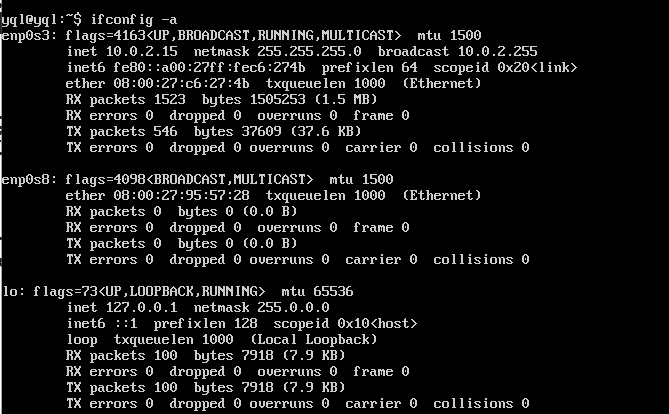
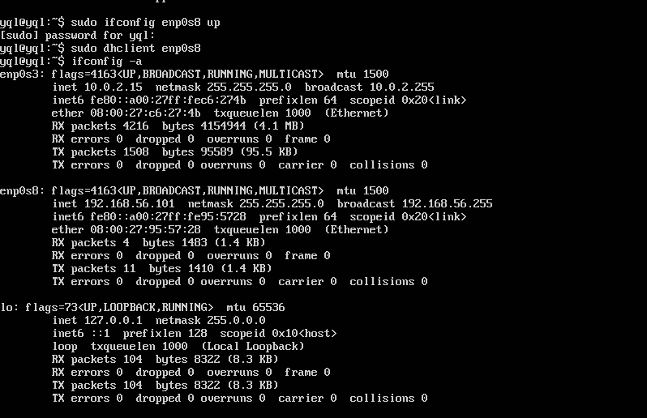
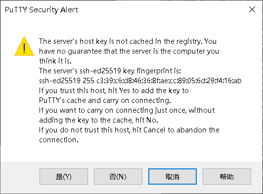
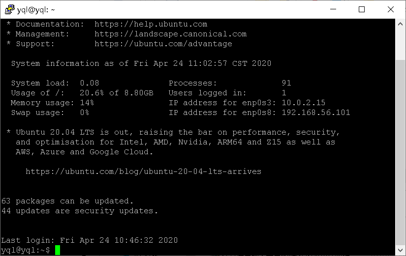
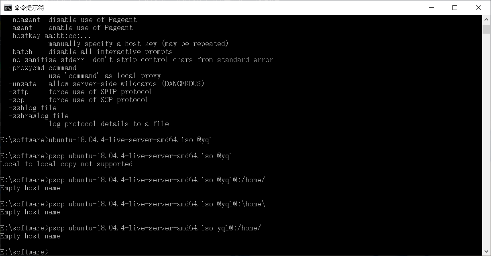
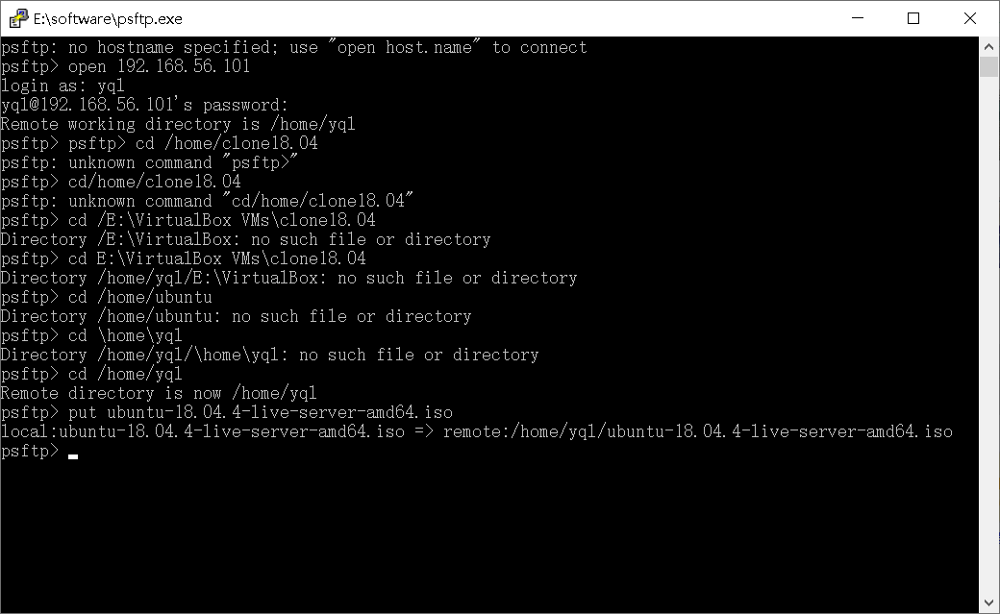
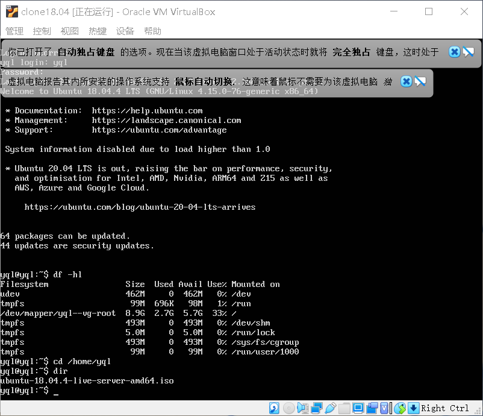
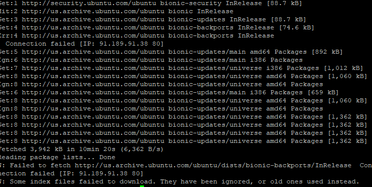
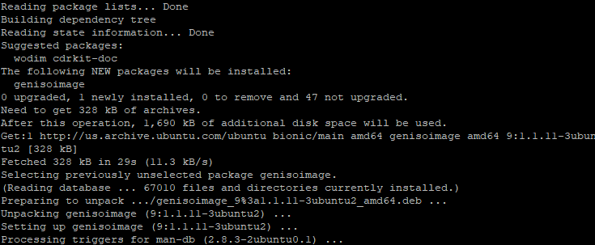
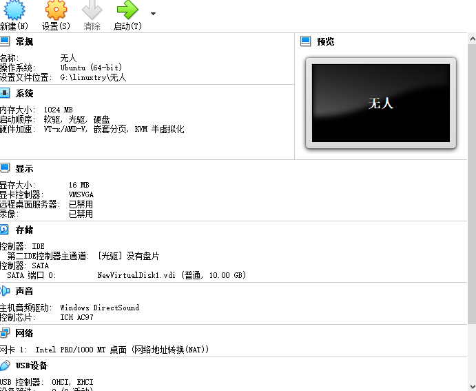

实验一
=
1.启用在虚拟机上安装好的ubuntu18.04.4，输入安装时设置的用户名密码进行登录。（虚拟机未启动的时候设置该虚拟机的两块网络网卡：host-only和NAT）

使用ifconfig -a查看当前网卡状态

显示如

所以可以看到第二块网卡并没有开启，故而用

sudo ifconfig enp0s8 up

sudo dhclient enp0s8

再次输入ifconfig -a查看，发现已经成功开启

显示如

2.在putty上连接，输入用ifconfig查到的ip地址，连接成功后进去输入用户名密码进行登录，首次连接会跳出指纹验证的警告框,显示如

成功连接putty后显示如下

3.在进行虚拟机与本地文件互传时遇到问题，刚开始不知道在哪个端口用put进行传输，在网上搜索到使用pscp，但是一登录就闪退了，又搜索到用windows的命令框，但是还是失败了。

如图

最后问过同学后知道可以自putty目录下使用psftp把用于ubuntu18.04.4的镜像文件从Windows复制进虚拟机，镜像文件需要放在psftp目录下

但是在此处又遇到一个问题，我使用ubuntu18.04.4在本地的路径，发现总是报错说找不到该路径

后来问过同学后才知道，该路径是虚拟硬盘下的虚拟路径,最后成功传输

psftp> cd /home/yql

put ubuntu-18.04.4-server-amd-iso

如图

如图

向该文件中加入下面内容并保存

label autoinstall
  menu label ^Auto Install Ubuntu Server
  kernel /install/vmlinuz
  append  file=/cdrom/preseed/ubuntu-server-autoinstall.seed debian-installer/locale=en_US console-setup/layoutcode=us keyboard-configuration/layoutcode=us console-setup/ask_detect=false localechooser/translation/warn-light=true localechooser/translation/warn-severe=true initrd=/install/initrd.gz root=/dev/ram rw quiet

但是总是保存不成功，在网上搜了解决的办法，也没有成功。

定制preseed.cfg  此处我使用老师给出的autoinstall文件，修改了其中的默认系统用户名密码。尝试了两种方式将该文件保存到/home/ubuntu/cd/preseed/ubuntu-server-autoinstall.seed
1.用psftp传输 2.用vim编辑器创建

重新生成md5sum.txt
sudo su -
cd /home/cuc/cd && find . -type f -print0 | xargs -0 md5sum > md5sum.txt

封闭改动后的目录到.iso
IMAGE=custom.iso
BUILD=/home/cuc/cd/

mkisofs -r -V "Custom Ubuntu Install CD" \
            -cache-inodes \
            -J -l -b isolinux/isolinux.bin \
            -c isolinux/boot.cat -no-emul-boot \
            -boot-load-size 4 -boot-info-table \
            -o $IMAGE $BUILD
（参数中的空格注意不能少）

此时出现了报错，使用下面两条指令

apt-get update

apt-get install genisoimage

结果如下：

之后在虚拟机就会出现custom.iso这个镜像，使用命令将其移动到其父文件夹内从而传输

mv custom.iso ../

4.打开psftp
get custom.iso

从虚拟机中将custom.iso这个镜像文件复制出来，这个文件就是我们需要的无人值Linux文件，打开VirtualBox 从custom.iso镜像中安装系统

5.用VirtualBox打开虚拟机

如图