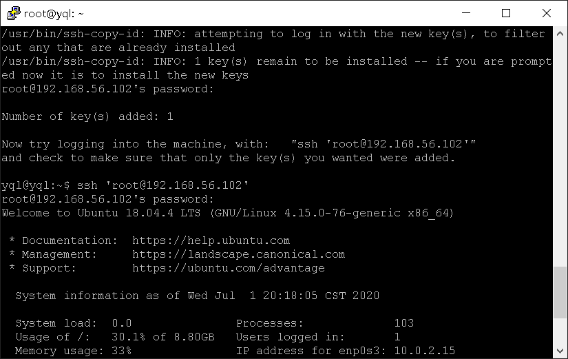
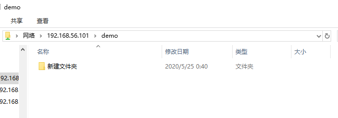

# HW6-shell脚本编程练习进阶

----
## 一.实验要求
  * FTP
     *  对照第6章课件中的要求选择一款合适的FTP服务器软件支持所有任务要求，在本实验中选取的服务器软件为proftpd
  * NFS
     *  对照第6章课件中的NFS服务器配置任务
  * DHCP
     *  2台虚拟机使用Internal网络模式连接，其中一台虚拟机上配置DHCP服务，另一台服务器作为DHCP客户端，从该DHCP服务器获取网络地址配置2台虚拟机使用Internal网络模式连接，其中一台虚拟机上配置DHCP服务，另一台服务器作为DHCP客户端，从该DHCP服务器获取网络地址配置
  * Samba
     *  对照第6章课件中smbclient一节的3点任务要求完成Samba服务器配置和客户端配置连接测试
  * DNS
     * 基于上述Internal网络模式连接的虚拟机实验环境，在DHCP服务器上配置DNS服务，使得另一台作为DNS客户端的主机可以通过该DNS服务器进行DNS查询
     * 在DNS服务器上添加 zone "cuc.edu.cn" 的以下解析记录   

## 实验步骤
### 工作主机免密SSH登录目标主机
- #### 生成并导入SSH-KEY至目标主机
    - 在工作主机生成ssh-key
        ```bash
        # foo为Key的名称
        ssh-keygen -f foo
        ```
    - 修改目标主机```/etc/ssh/sshd_config```配置
        ```bash
        # 设置可通过口令认证SSH
        PasswordAuthentication yes
        # 可以root用户登录
        PermitRootLogin yes
        ```
    - 重启目标主机的SSH服务
        ```bash
        sudo systemctl restart ssh
        ```
    - 工作主机通过```ssh-copy-id```方式导入ssh-key
        ```bash
        ssh-copy-id -i ~/foo root@192.168.56.102
        ```
 
- #### 设置免密登录
    - 取消root口令并禁用口令登录
        ```bash
        sudo passwd -l root
        # 修改目标主机配置文件
        vim /etc/ssh/sshd_config
        PasswordAuthentication no
        PermitRootLogin without-password

        # 重启ssh服务
        sudo systemctl restart ssh
       ```
         
    
   
   
   
  
 *  **FTP**
  * 服务器选择：vsftpd
  * 脚本文件：[vsftpd.sh](scripts/vsftpd.sh)
  * 配置文件：[/etc/vsftpd.conf](configs/vsftpd.conf)
  * 通过工作主机运行脚本在目标主机安装vsftpd并完成相关配置
  
    * 将脚本文件`vsftpd.sh`拷贝到目标主机：`scp -i .ssh/foo workspace/shell/vsftpd.sh root@192.168.56.102:workspace/`
     

    * 借助SSH的远程命令执行功能实现目标主机控制安装和配置：`ssh -i .ssh/foo root@192.168.56.102 'bash workspace/vsftpd.sh'`
     

  * 配置一个提供匿名访问的FTP服务器，匿名访问者可以访问1个目录且仅拥有该目录及其所有子目录的只读访问权限

  * 配置一个支持用户名和密码方式访问的账号，该账号继承匿名访问者所有权限，且拥有对另1个独立目录及其子目录完整读写（包括创建目录、修改文件、删除文件等）权限
  
    * 用户名密码登录

    * 删除文件、创建目录、修改文件
     

    * FTP用户不能越权访问指定目录之外的任意其他目录和文件（注意：不是通过 绝对路径 方式来遍历，而是验证通过 相对路径 （例如 cd ../../../../ ）方式无法翻出 FTP 服务器指定的当前用户的 家目录 访问到 家目录及其所有子目录 以外的任何其他目录）
     
     

    * 匿名访问权限仅限白名单IP来源用户访问，禁止白名单IP以外的访问
     

    * 实验结果
     

  * 参考
    * [vsftpd](https://security.appspot.com/vsftpd.html)
    * [FTP Server && vsftpd-FTP Server](https://ubuntu.com/server/docs/service-ftp)

* **NFS**   
   *  在1台Linux上配置NFS服务，另1台电脑上配置NFS客户端挂载2个权限不同的共享目录，分别对应只读访问和读写访问权限      

   *  Host
      *  配置NFS服务
         * sudo apt-get update
         * sudo apt-get install nfs-kernel-server
      *  创建一个用于挂载的（可读写）文件夹
         *  sudo mkdir /var/nfs/general -p
         *  sudo chown nobody:nogroup /var/nfs/general
      *  修改/etc/exports文件（即NFS服务的主要配置文件）
         *  /var/nfs/general 192.168.92.102(rw,sync,no_subtree_check)   
         *  /home 192.168.92.102(sync,no_root_squash,no_subtree_check)  
    *  Client
      *  配置NFS服务
         *  sudo apt-get update
         *  sudo apt-get install nfs-common
      *  创建相应的挂载文件
         *  sudo mkdir -p /nfs/general
         *  sudo mkdir -p /nfs/home
      *  挂载文件夹
         *   sudo mount 192.168.92.101:/var/nfs/general /nfs/general
         *   sudo mount 192.168.57.7:/home /nfs/home
             *  【注意事项】，在进行挂载的时候，可能会出现如下问题，是因为NFS服务尚未启动
                        
             * 所以在执行前启动NFS服务

                        sudo service nfs-kernel-server restart
* **DNS**
  * 基于上述Internal网络模式连接的虚拟机实验环境，在DHCP服务器上配置DNS服务，使得另一台作为DNS客户端的主机可以通过该DNS服务器进行DNS查询
  * 在DNS服务器上添加 zone "cuc.edu.cn" 的解析记录
  
  * 配置文件：
    
  
  * server
  
    * 安装bind9：`sudo apt update && sudo apt install bind9`
    * 修改配置文件`sudo vim /etc/bind/named.conf.options`
           
          #在options选项中添加以下配置
          listen-on { 192.168.56.102; };  # ns1 private IP address - listen on private network only
          allow-transfer { none; }; # disable zone transfers by default
          forwarders {
             8.8.8.8;
              8.8.4.4;
          };
    * 编辑配置文件`sudo vim /etc/bind/named.conf.local`

          #添加如下配置
          zone "cuc.edu.cn" {
              type master;
              file "/etc/bind/db.cuc.edu.cn";
          };
    * 生成配置文件`db.cuc.edu.cn`
  
          $ sudo cp /etc/bind/db.local /etc/bind/db.cuc.edu.cn
    * 编辑配置文件`sudo vim /etc/bind/db.cuc.edu.cn`
     
    * 重启bind9：`sudo service bind9 restart`
  
  * client
     * 安装resolvconf：`sudo apt update && sudo apt install resolvconf`
     
     * 修改配置文件：`sudo vim /etc/resolvconf/resolv.conf.d/head`

            #添加配置
            search cuc.edu.cn
            nameserver 192.168.57.1
      * sudo resolvconf -u
  * 测试结果：
   
   

   

    

  * 参考[DNS_Service](https://ubuntu.com/server/docs/service-domain-name-service-dns)
  
 **Samba**
  
  * **在windows 10客户端上连接Linux上的Samba服务器**


    > 配置文件目录：`/etc/samba/smb.conf`
    > 服务启动\停止\重启等命令：`/etc/init.d/smbd {start|stop|reload|restart|force-reload|status}`
    

    * 打开资源管理器，右键“此电脑”，选择“添加一个网络位置”
     
     
    * 输入共享文件夹路径
    
     
     
     

    * 访问匿名目录，不用输入账号密码，且不可以创建文件夹
     

    * 访问指定用户文件夹，需要输入账号密码，且可以创建文件夹，(注：此处的账号密码是之前配置过的samba用户与密码)
    
     
     
     
  
  * **ＤＨＣＰ**
     *  具体步骤
           *  编辑 server的/etc/network/interfaces文件，添加以下内容
                           
           *  编辑server的/etc/default/isc-dhcp-server文件，添加以下内容　　　　　　　　　　
                 *  INTERFACES="enp0s9"
           *  编辑server的/etc/dhcp/dhcpd.conf文件，添加以下内容
           

##　三.实验参考链接

[实验六报告](https://github.com/CharleneTan/linux/blob/master/2017-1/TJY/%E7%BD%91%E7%BB%9C%E8%B5%84%E6%BA%90%E5%85%B1%E4%BA%AB/%E7%BD%91%E7%BB%9C%E8%B5%84%E6%BA%90%E5%85%B1%E4%BA%AB.md)

[Setting Up an NFS Mount on Ubuntu 16.04](https://www.digitalocean.com/community/tutorials/how-to-set-up-an-nfs-mount-on-ubuntu-16-04)

[Setting up Samba as a Standalone Server](https://wiki.samba.org/index.php/Setting_up_Samba_as_a_Standalone_Server)

[Configure BIND as a Private Network DNS Server on Ubuntu 14.04](https://www.digitalocean.com/community/tutorials/
[](https://github.com/CUCCS/2015-linux-public-U2Vino/tree/HW-6)
how-to-configure-bind-as-a-private-network-dns-server-on-ubuntu-14-04)